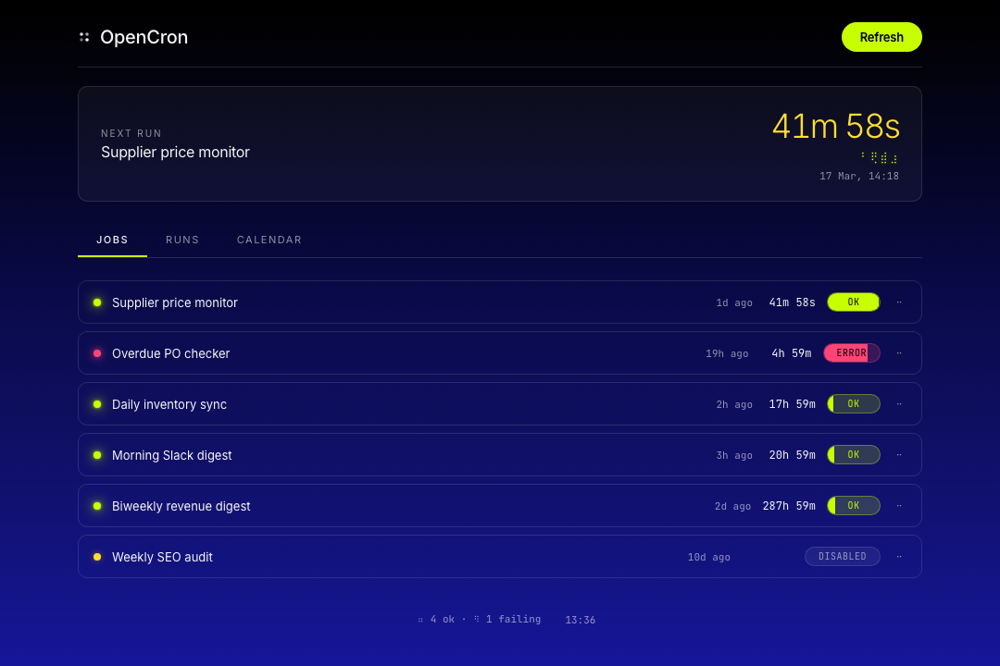
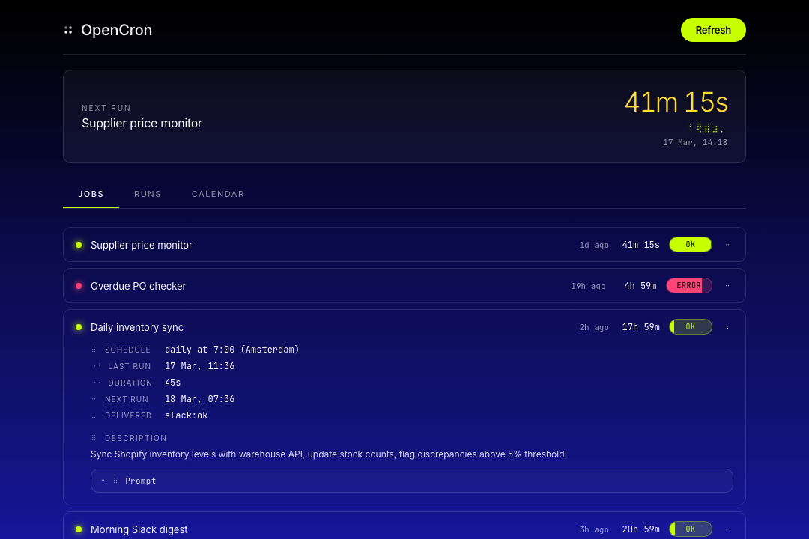
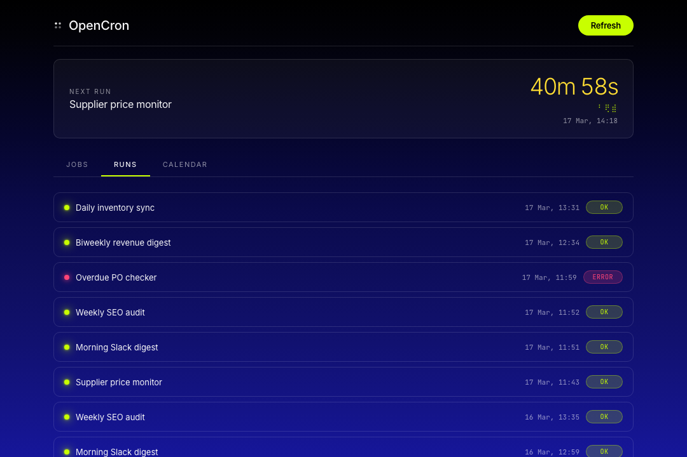
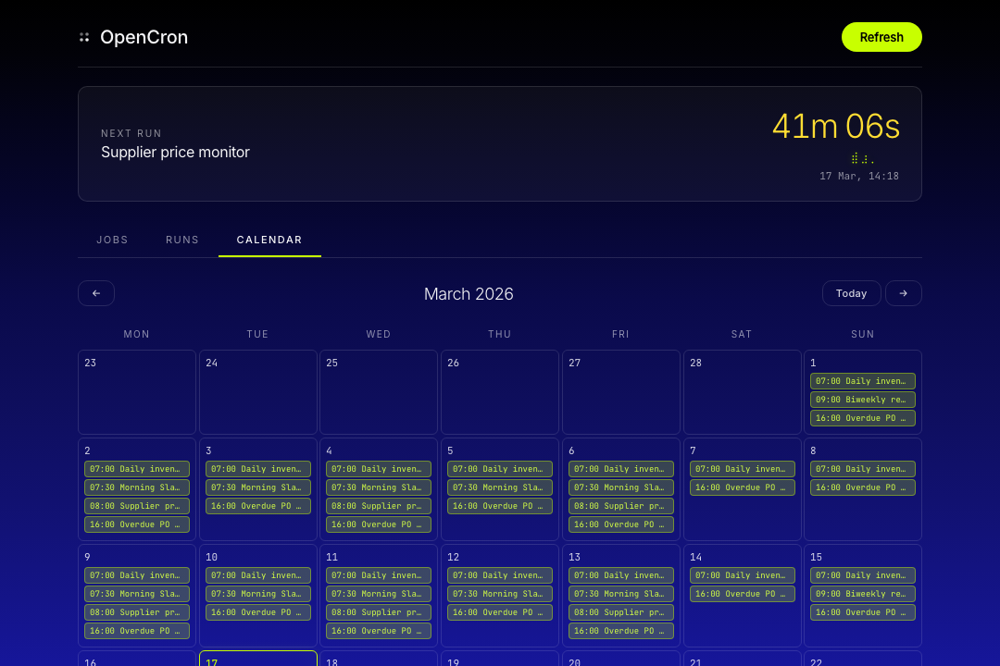

# OpenCron

A single-file dashboard that turns your cron jobs into something you actually want to look at.

## What you get

**Live countdowns** that tick every second. Badge fills that show progress toward the next run. Braille unicode icons instead of bloated icon fonts. Smooth animations that serve as feedback, not decoration.

**Run history** with duration, model, tokens, and output — all expandable inline.

**Calendar view** showing past results and upcoming scheduled runs at a glance.

## One file, zero dependencies

`cron-dashboard.html` is the entire dashboard. No build step, no npm, no framework. Open it in a browser and it works.

- Auto-refreshes every 30s
- Responsive, works on mobile
- Respects `prefers-reduced-motion`
- Token auth, no credentials client-side

## Try it

Open [`demo.html`](demo.html) in any browser — fully working with mock data, no server needed.

## Use with OpenClaw

See [opencron-skill](https://github.com/firstfloris/opencron-skill) for one-command deployment.

## License

MIT
